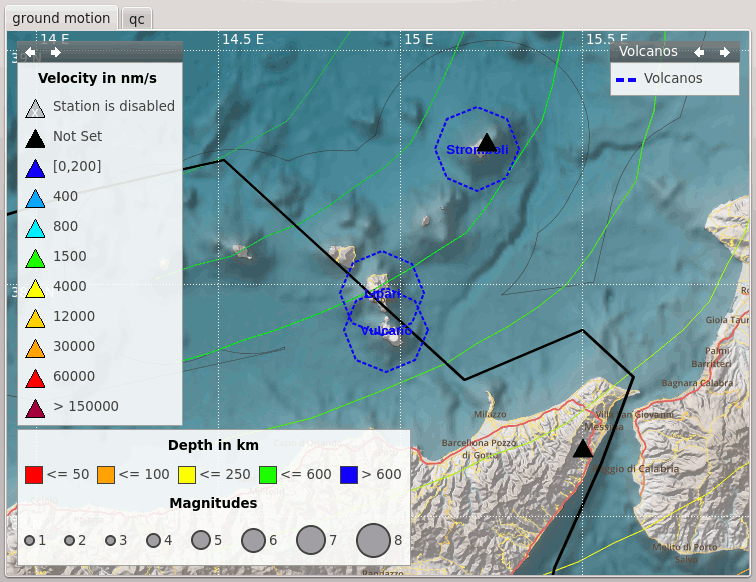

All |scname| graphical user interfaces are based on a common libraries.
This chapter describes what configuration and styling options are available for
all GUI applications. The GUI specific configuration options are additional to
the standard application options. Setup the e.g. messaging connection and database
is equal to the CLI (command line interface) applications.

.. _sec-gui_styles:

Styling
=======

To adjust the look-and-feel to the host desktop system and the personal taste
several styling options are available. Since all GUI applications are using the
Qt4 or QT5 library, the tool "qtconfig-qt4" can used to adjust the widget theme and the
colors. If KDE is used as desktop system, the same style is used since KDE
bases on Qt as well.

The style options supported by |scname| (and not covered by the general Qt setup)
have to be given in the applications (or global) configuration file. The
parameters are configured with the *scheme.* parameters.

In case of :ref:`map layers defined by geo feature files <sec-gui_layers>` the
parameters may also be defined by :file:`map.cfg` in the directory of the geo
feature file.

.. _sec-gui_syntax:

Configuration syntax
====================

Beside the usual integer, float, boolean and string parameters GUI applications
support also :ref:`color <sec-gui_color>`, :ref:`color gradient <sec-gui_colorgradient>`,
:ref:`pen <sec-gui_pen>`, :ref:`brush <sec-gui_brush>`, :ref:`font <sec-gui_font>`
and :ref:`symbol <sec-gui_symbol>` parameters. The syntax is explained below:

.. _sec-gui_color:

Colors
------

.. code-block:: sh

   color = red | RRGGBBAA | "rgb(red,green,blue)" | "rgba(red,green,blue,alpha)"

Colors are specified either by :term:`color keyword names <color keyword name>`,
in a hexadecimal notation or in a rgb(a) notation. When using the rgb(a)
notation it should be quoted. Otherwise the configuration
parser would tokenize the value into 3 or 4 strings due to the comma.

.. _sec-gui_colorgradient:

Color gradients
---------------

.. code-block:: sh

   gradient = 1:FF0000, 2:00FF00, 3:0000FF

This defines a gradient from red through green to blue for the nodes 1, 2 and 3.
Values out of range are clipped to the lower or upper bound.

.. _sec-gui_font:

Fonts
-----

.. code-block:: sh

   # The font family
   font.family = "Arial"

   # Point size
   font.size = 12

   # Bold?
   # Default: false
   font.bold = false

   # Italic?
   # Default: false
   font.italic = false

   # Underline?
   # Default: false
   font.underline = false

   # Overline?
   # Default: false
   font.overline = false

An example to configure the SC3 base font:

.. code-block:: sh

   scheme.fonts.base.family = "Arial"
   scheme.fonts.base.size = 10

.. _sec-gui_pen:

Pens
----

Pens are used in the vector layer configuration. Pens have three attributes:
color, style and width. Color follows the described :ref:`color definition <sec-gui_color>`, width
is a double and the styles are:

+------------------------------------+---------------------------------------+------------------------------------------+
| .. figure:: media/gui/pen-no.png   | .. figure:: media/gui/pen-solid.png   | .. figure:: media/gui/pen-dot.png        |
+------------------------------------+---------------------------------------+------------------------------------------+
| nopen                              | solidline                             | dotline                                  |
+------------------------------------+---------------------------------------+------------------------------------------+
| .. figure:: media/gui/pen-dash.png | .. figure:: media/gui/pen-dashdot.png | .. figure:: media/gui/pen-dashdotdot.png |
+------------------------------------+---------------------------------------+------------------------------------------+
| dashline                           | dashdotline                           | dashdotdotline                           |
+------------------------------------+---------------------------------------+------------------------------------------+
| *Images from Qt 4.1 documentation: http://doc.qt.digia.com/4.1/qt.html#PenStyle-enum*                                 |
+------------------------------------+---------------------------------------+------------------------------------------+

Example:

.. code-block:: sh

   # Blue dotted pen
   pen.color = 0000ff
   pen.style = dotline

.. _sec-gui_brush:

Brushes
-------

Brushes are also used in the vector layer configuration. Brushes are used to
fill a polygon. They have two attributes: color and style. Color follows the
described :ref:`color definition <sec-gui_color>` and styles are:

.. figure:: media/gui/brush-patterns.png

Example:

.. code-block:: sh

   # Red solid brush
   brush.color = ff0000
   brush.style = solid

.. _sec-gui_symbol:

Symbols
-------

Symbols configured by the :confval:`symbol.*` parameters can be plotted on coordinate
points defined by :ref:`geo feature files <sec-gui_layers>` or by :confval:`symbol.icon.hotspot.x`
and :confval:`symbol.icon.hotspot.y`. The symbols can be shapes (:confval:`symbol.shape`)
or icons from a file (:confval:`symbol.icon`).

.. _sec-gui_legend:

Legends
-------

Legends are plotted on maps describing :ref:`map vector layers <sec-gui_layers>`.
Styles are:

.. csv-table::
   :header: "Name", "Description", "Example"
   :widths: 1, 3, 3

   ":confval:`title`", "Title", "title = Faults"
   ":confval:`orientation`", "Orientation: vertical, horizontal", "orientation =  vertical"
   ":confval:`legendArea`", "Position: topleft, topright, bottomleft, bottomright", "legendArea = topleft"

.. _sec-gui_layers:

Map Layers
==========

Additional features may be added to maps using configurable layers:

* :ref:`sec-gui_layers-vector`, e.g. points, polylines, polygons from FEP, BNA or GeoJSON files,
* :ref:`sec-gui_layers-others`, e.g. cities, grids, events, custom layers.

:ref:`sec-gui_layers-vector` are loaded and may be visualized together with
:ref:`other layers <sec-gui_layers-others>`. The order of the drawing is defined by :confval:`map.layers`.

The map layers can be explained on the maps by :ref:`configurable legends <sec-gui_legend>`
and selected interactively by their :ref:`configurable category <sec-gui_layers-config>`.

   Map with layers defined by polygons, cities and legends.

.. _sec-gui_layers-vector:

Vector layers
-------------

.. admonition:: Deprecation warning
   :class: warning

   The old directories :file:`@DATADIR@/bna` or :file:`@CONFIGDIR@/bna`
   are still supported but superseded by :file:`@DATADIR@/spatial/vector` or
   :file:`@CONFIGDIR@/spatial/vector`. The latter directories have higher priority.
   If one of the old directories has been found, a warning will be logged.

|scname| supports arbitrary polygons, polylines or points for drawing as layers
on maps or for using by other :term:`modules <plugin>` and :term:`plugins <plugin>`.
The polygons, polylines and points can be customized by the
:ref:`available attributes <sec-gui_syntax>`. Currently supported data types
are:

* FEP (Flinn-Engdahl polygons):

  * used for visualization of events regions and for setting the region name of
    the event by :ref:`scevent`.
  * stored in directories: :file:`@DATADIR@/fep` or :file:`@CONFIGDIR@/fep`
  * file name extension: *.fep*
  * file format: ::

       longitude1 latitude1
       longitude2 latitude2
       longitude3 latitude3
       ...
       99.0 99.0 length
       L name

    where the coordinates, *length* and *name* are to be replaced by actual values,
  * visibility and style can be controlled by :ref:`configuration <sec-gui_layers-config>`
    and :confval:`map.layers.fep.visible`.

* BNA polygons:

  * used for visualization, e.g. points, polylines, polygons for faults or districts,
    respectively, and even symbols or images on maps. Some objects, like closed lines can be
    evaluated by other modules and plugins, e.g. the :ref:`region check <scevent_regioncheck>`
    plugin for :ref:`scevent`.
  * stored in directories or sub-directories of: :file:`$SEISCOMP_ROOT/share/spatial/vector`
    or :file:`~/.seiscomp/spatial/vector`
  * file name extension: *.bna*
  * file format: ::

       "name 1","rank 1",type/length
       longitude1,latitude1
       longitude2,latitude2
       longitude3,latitude3
       ...

    where the coordinates, *name* and *type/length* are to be replaced by actual values.
    For polylines (open polygons) set type/length to the negative number of points defining
    the line, e.g. -10. Positive numbers, e.g. 10, define closed polygons. Such
    polygons are automatically closed between their end points. Thus, the end points
    do not need to be identical.

    The BNA file format also supports multiple vertices per line and the definition
    of islands. Please refer to https://www.softwright.com/faq/support/boundary_file_bna_format.html
    for more format specifications.

    .. note ::

       * All |scname| map applications support the drawing of polygons and a subsequent
         export to the BNA format.
       * An extension of the header entries is possible. The extra entries can be
         used by other modules or plugins, e.g. the :ref:`region check <scevent_regioncheck>`
         plugin. Example ::

            "coal","rank 1","eventType: mining explosion, minDepth: -5, maxDepth: 10",6
       * The name is extracted from the first part of the header.
       * The rank is extracted from the second part of the header if it has the
         form "rank VALUE", e.g. rank 12.

  * visibility and style can be controlled by :ref:`configuration <sec-gui_layers-config>`.

* GeoJSON features:

  * used for visualization, e.g. points, polylines, polygons for faults or districts,
    respectively, and even symbols or images on maps.
  * stored in directories or sub-directories of: :file:`$SEISCOMP_ROOT/share/spatial/vector` or :file:`~/.seiscomp/spatial/vector`
  * file name extension: *.geojson*
  * file format: https://geojson.org/

    .. note ::

       Currently the geometry type GeometryCollection is not supported. The name
       of the feature is derived from the `name` property of a feature and the
       rank can be provided in a `rank` property with an integer value.

.. _sec-gui_layers-config:

Layer configuration
~~~~~~~~~~~~~~~~~~~

Layers may be grouped into categories and form a hierarchy. The categories of the
geo feature data are derived from the feature directory structure, i.e. the names
of the directories below the feature directory, e.g. :file:`@DATADIR@/spatial/vector`.
Feature data directly located within the feature directory have no special category.
The FEP data set is assigned to the fep category.

The depth of the feature directory tree is arbitrary and subfolders form
sub-categories. E.g. the directory tree
:file:`$SEISCOMP_ROOT/share/spatial/vector/coastline/europe/germany` will generate
the categories *coastline*, *coastline.europe* and *coastline.europe.germany* which
all may be configured individually. Every undefined property is inherited from
the parent category.

The layer properties can be configured either by

* Global module configuration parameters or
* Layer-specific configuration files (:file:`map.cfg`).

.. note ::

   The parameters in the global configuration of modules override the configurations
   in :file:`map.cfg` allowing a specific configuration per application.

All data set directories and sub-directories therein are scanned for an optional
:file:`map.cfg` configuration file defining default drawing options. Parameters
found in the lowest sub-directory take priority.
This allows easy distribution of data sets and drawing properties without the
need to change application configuration files.
The available map layer configuration parameters are described further below.

The default drawing options may be overridden in the global or application
configuration file using the format *prefix.category.param*. If global layer
properties are configured, then just use *prefix.param*. The prefix for layer
configuration is *map.layers*. Due to its recursive structure the configuration
options are not available through :ref:`scconfig`.

Examples
~~~~~~~~

File and directory for plotting fault lines with specific configurations.
The geo features are defined in :file:`data.bna`, configurations are in
:file:`map.cfg`:

.. code-block:: sh

   @DATADIR@/spatial/vector/
   ├── maps.cfg
   ├── faults/
   |   ├── map.cfg
   |   ├── reverse/
   |   |   ├── map.cfg
   |   |   ├── data.bna
   |   ├── normal/
   |   |   ├── map.cfg
   |   |   ├── data.bna
   |   ├── strike-slip/
   |   |   ├── map.cfg
   |   |   ├── data.bna
   ├── others/
   |   ├── maps.cfg
   |   ├── data.bna

Configuration examples for plotting the fault lines based on the example above:

* Legend control in :file:`@DATADIR@/spatial/vector/faults/map.cfg` ::

     # title of legend for all legend entries
     title = "Faults"
     # plot the legend vertically
     orientation = vertical
     # plot the legend in the top-right corner
     legendArea = topright

* Polygon property control in :file:`@DATADIR@/spatical/vector/faults/strike-slip/map.cfg`
  common to all polygons in this directory. You may generate
  different sub-directories with different parameters inheriting the legend and other
  properties. Put this file, e.g. in the strike-slip directory. ::

     # make the layer visible
     visible = true
     # do not draw the name of the polygon
     drawName = false
     # draw a solid line
     pen.style = solidline
     # set the pen with to 1 px
     pen.width = 1
     # set the pen line to blue
     pen.color = blue
     # label to be shown in legend
     label = "strike-slip"

Instead of using :file:`map.cfg`, the same properties can also be set per layer
category by global parameters in module configurations, e.g. for the layer *strike-slip*
below *faults* (:file:`global.cfg`): ::

   map.layers.faults.title = "Faults"
   map.layers.faults.orientation = vertical
   map.layers.faults.legendArea = topright
   map.layers.faults.strike-slip.visible = true
   map.layers.faults.strike-slip.drawName = false
   map.layers.faults.strike-slip.pen.style = solidline
   map.layers.faults.strike-slip.pen.width = 1
   map.layers.faults.strike-slip.pen.color = blue
   map.layers.faults.strike-slip.label = "strike-slip"

Parameters
~~~~~~~~~~

Available map layer configuration parameters for each category are:

.. confval:: visible

   Type: *boolean*

   Show/hide the layer
   Default is ``true``.

.. confval:: title

   Type: *string*

   Title of the legend for this directory. If the title is empty
   then no legend will be created. A legend will show the label
   of its own directory and all its subdirectories.

.. confval:: label

   Type: *string*

   The legend label for this directory.

.. confval:: index

   Type: *int*

   The index of the label in the legend. All labels will be
   sorted by their index in ascending order.

   Default is ``0``.

.. confval:: legendArea

   Type: *string*

   The area in the map where the legend will be displayed.
   Valid values are *topleft*, *topright*, *bottomleft* and
   *bottomright*.

   Default is ``topleft``.

.. confval:: orientation

   The orientation of the legend, either *vertical* or *horizontal*.

   Default is ``vertical``.

.. confval:: drawName

   Type: *boolean*

   Draws the segment name in the center of the bounding box.
   Default is ``false``.

.. confval:: rank

   Type: *int*

   Set or override the rank of the segment. The rank defines
   the zoom level at which drawing of the segment starts.
   Default is ``1``.

.. confval:: roughness

   Type: *int*

   Sets the roughness of a polyline or polygon while zooming. The roughness
   is somehow defined in pixels and removes successive vertices if the distance
   in pixel is less than roughness. The higher the value the less vertices
   a rendered polyline or polygon will finally have and the faster the rendering.
   If set to 0 then the feature is disabled.
   Default is ``3``.

.. confval:: symbol.size

   Type: *int*

   In case of single points, this specifies the size of the symbol in pixels.

   Default is ``8``.

.. confval:: symbol.shape

   Type: *string*

   In case of single points, this specifies the shape of the symbol. Valid
   values are *circle* and *square*.

   Default is ``circle``.

.. confval:: symbol.icon

   Type: *string*

   In case of single points this specifies the path to an image used as
   icon to represent the map location. The image is scaled to :confval:`symbol.size`
   if it is larger than zero otherwise the origin size is being used.

.. confval:: symbol.icon.hotspot.x

   Type: *int*

   The X coordinate of the symbol image which is rendered at the map
   location longitude. This coordinate is in unscaled image space.

   Default is ``0``.

.. confval:: symbol.icon.hotspot.y

   Type: *int*

   The Y coordinate of the symbol image which is rendered at the map
   location latitude. This coordinate is in unscaled image space
   starting at top.

   Default is ``0``.

.. confval:: debug

   Type: *boolean*

   If enabled, the bounding box of the segment is drawn.
   Default is ``false``.

.. confval:: pen.width

   Type: *double*

   Pen width.
   Default is ``1.0``.

.. confval:: pen.color

   Type: *color*

   Pen color.
   Default is ``000000ff``.

.. confval:: pen.style

   Type: *string*

   Line style. Supported values are: dashdotdotline, dashdotline, dashline,
   dotline, nopen and solidline.
   Default is ``solidline``.

.. confval:: brush.color

   Type: *color*

   Fill color.
   Default is ``000000ff``.

.. confval:: brush.style

   Type: *string*

   Fill style. Supported values are:
   nobrush, solid, dense1, dense2, dense3, dense4,
   dense5, dense6, dense7, horizontal, vertical,
   cross, bdiag, fdiag and diagcross.
   Default is ``nobrush``.

.. confval:: font.size

   Type: *int*

.. confval:: font.family

   Type: *string*

.. confval:: font.bold

   Type: *boolean*

.. confval:: font.italic

   Type: *boolean*

.. confval:: font.underline

   Type: *boolean*

.. confval:: font.overline

   Type: *boolean*

.. confval:: composition

   The image composition mode. Valid values are
   *src-in*, *dst-in*, *src-out*, *dst-out*, *src-atop*,
   *dst-atop*, *xor*, *plus*, *multiply*, *screen*,
   *overlay*, *darken*, *lighten*, *color-dodge*,
   *color-burn*, *hard-light*, *soft-light*, *difference*,
   *exclusion*, *src-or-dst*, *src-and-dst*, *src-xor-dst*,
   *not-src-and-not-dst*, *not-src-or-not-dst*,
   *not-src-xor-dst*, *not-src*, *not-src-and-dst* and
   *src-and-not-dst*.

   An explanation can be found at the Qt
   developer documentation, e.g.
   https://doc.qt.io/qt-5/qpainter.html#composition-modes.

   Default is ``src-over``.

.. _sec-gui_layers-others:

Other Layers
------------

Other layers may be displayed on maps depending on the application.

* Events layer:

  Event symbols are shown as an extra layer, e.g. in the Location tab of :ref:`scolv`.
  Activate in the global module configuration by :confval:`map.layers.events.visible`.

* Cities layer:

  Cities are plotted based on the XML file :file:`@DATADIR@/cities.xml`. Custom
  XML files, e.g. for multi-language support are provided by :confval:`cityXML`.
  Properties are configured in various global module parameters :confval:`scheme.map.*`
  and :confval:`scheme.colors.*`.

* Grid layer:

  The latitude/longitude grid plotted on top of maps. Properties are configured
  in the global module parameters :confval:`scheme.colors.map.grid.*`.

* Custom layers:

  Additional custom layers may be added which can be loaded and displayed by specific
  modules or plugins. They are added by :confval:`map.customLayers`.
