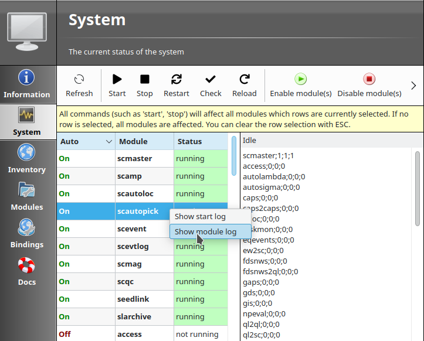
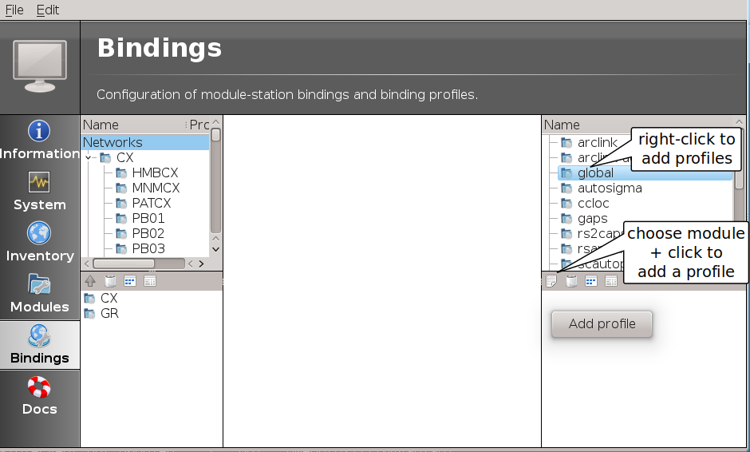
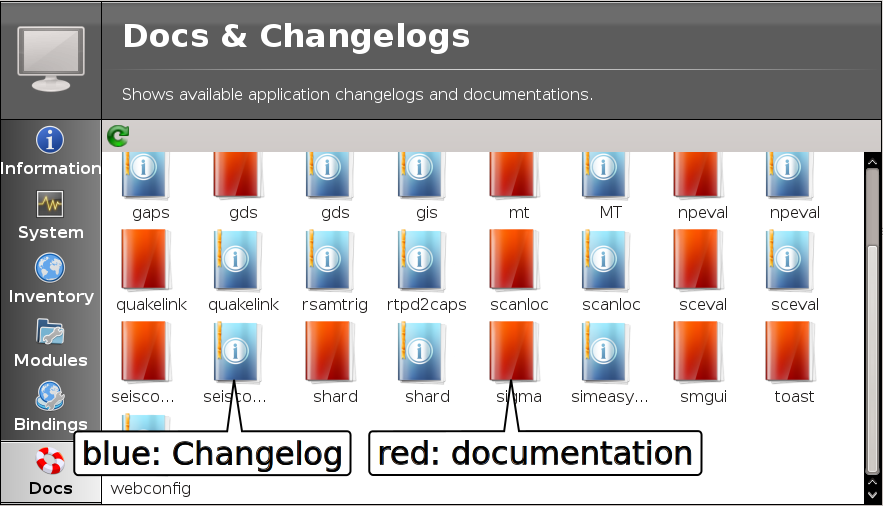

scconfig is a graphical user interface which allows to

* Retrieve :ref:`information <scconfig-information>` about the installed |scname|
  system,
* :ref:`Control modules <scconfig-system>` and access logging file,
* :ref:`Import, check, synchronize and remove <scconfig-inventory>` station meta
  data/inventory,
* Configure the :ref:`module configuration <scconfig-modules>` and
  :ref:`bindings <scconfig-bindings>` all SeisComP modules for which descriptions
  are provided,
* Access the :ref:`documentation and the changelog <scconfig-documentation>`.

The modules are usually programs part of the SeisComP system and have two
distinct types of configuration:

#. :ref:`Modules configuration <scconfig-modules>`, or just program configuration like the
   :file:`scautopick.cfg` file.
#. :ref:`Station bindings <scconfig-modules>`, that are set of parameters to configure how the module will
   treat a certain station. I.e. Station specific configurations per module.

The bindings configuration can be done using profiles, or directly per station.

A profile is a named set of parameters for a certain module that can be
attributed for more than one station. Using profiles makes it easiear to
maintain large number of station configuration. When two stations are configured
by the same profile, both will have the same parameter set for a certain module.

scconfig does not know anything about the SeisComP database, the only thing it
can do is actually read and write the content of files from :file:`etc/` and
:file:`~/.seiscomp` folder and allow you to manage this information in organized
and friendly manner. Also, it relies on other application (like the proper
:program:`seiscomp` command) to complete the system configuration. The main
tasks that it can handle today are:

- start/stop/check all registered modules
- import station metadata from various sources
- configure modules
- configure module bindings

In the future, it could accumulate more tasks like inventory editor and even
more advanced system monitoring and log inspection.

.. _scconfig-first-start:

First start
-----------

If scconfig is started for the first time it will ask the user to setup
its new installation.

.. figure:: media/scconfig/first-start.*
   :align: center

If done already with the :ref:`command line interface <getting-started>`
this step can be skipped. If the setup has been run already is indicated by
the presence of the file :file:`var/run/seiscomp.init`.

If pressing yes, the setup wizard will be started and will configure exactly
the same parameters as described in :ref:`getting-started`.

.. figure:: media/scconfig/wizard-start.*
   :align: center

.. figure:: media/scconfig/wizard-finish.*
   :align: center

Pressing 'Finish' will run the setup and report the progress.

.. figure:: media/scconfig/wizard-done.*
   :align: center

Pressing 'Close' will launch the main configuration window.

.. _scconfig-mainwindow:

Main Window
-----------

The layout of the main window is always the same regardless of what panel
is selected.

.. _fig-scconfig-mainwindow:

.. figure:: media/scconfig/mainwindow.*
   :align: center
   :width: 18cm

   Main window of scconfig: mode switch (red), panel selection (yellow),
   panel title and description (green),
   panel content (blue)

It is divided into 4 areas:

- red: the mode switch (user vs. system)
- yellow: panel switch
- green: title and description of current panel
- blue: the content and interactive screen of the current panel

The main menu contains two entries: :guilabel:`File` and :guilabel:`Edit`.

The file menu allows to run the setup wizard (:guilabel:`Wizard`), to reload
the configuration (:guilabel:`Reload`), to save the
configuration (:guilabel:`Save`) and to close the configuration (:guilabel:`Quit`).

The edit menu allows to switch the current configuration mode. Pressing the
switch button in the upper left corner (red box) is a shortcut for this operation.

.. _scconfig-information:

Information panel
-----------------

This panel shows information about the SeisComP environment
(see figure :ref:`main window <fig-scconfig-mainwindow>`). All variables (except PATH) can
be used as placeholders in most of the configuration parameters which define
directories or files, e.g.:

.. code-block:: sh

   autoloc.grid = @CONFIGDIR@/autoloc/local.grid

.. _scconfig-system:

System panel
------------

The system panel is a graphical frontend for the :ref:`seiscomp <system-management>` script.

.. figure:: media/scconfig/system-overview.*
   :align: center
   :width: 18cm

It is divided into 3 parts: the toolbar on the top (red), the module list (green)
and the log window (blue).
The log window shows the output of all external programs called such as :program:`seiscomp`.
The standard output is colored black and standard error is colored brown.

.. note::
   Due to the buffering of the GUI it can happen that standard output and
   standard error logs are not in perfect order.

The toolbar gives access to the available operations. All operations
will affect the currently selected modules (rows). If no row is selected, all
modules are affected and the corresponding call to :program:`seiscomp <arg>` is done
without any module.

*Update*
 Updates the current module state by calling :program:`seiscomp --csv status`.

*Start*
 Calls :program:`seiscomp start`.

*Stop*
 Calls :program:`seiscomp stop`.

*Restart*
 Calls :program:`seiscomp restart`.

*Check*
 Calls :program:`seiscomp check`.

*Enable module(s)*
 Enables all selected modules for autostart.
 At least one module must be selected.

*Disable module(s)*
 Disables all selected modules for autostart.
 At least one module must be selected.

*Update configuration*
 Calls :program:`seiscomp update-config`. This is important after the
 module configuration or bindings have changed and before restarting the
 affected modules.

For applying an action to all modules deselect any modules selection pressing
:kbd:`ESC` and press the corresponding action button. When one ore multiple
modules are selected, the action is only applied to those.

To open the most recent log files of modules right click on the module name and
select the available log.

.. _scconfig-inventory:

Inventory panel
---------------

The inventory panel allows to import, check and synchronize inventory files as
well as to inspect the content or to rename or remove the files. The panel shows
a list of inventory XML files located in folder :file:`etc/inventory`. Only
:term:`SCML` files can be used as source for inventory data but various importers
exist to integrate inventory data from other formats. After the first start
the list is empty and contains only a README file.

.. figure:: media/scconfig/inventory-empty.*
   :align: center
   :width: 18cm

Importing station meta data is outlined in the
:ref:`tutorial on adding a station <tutorials_addstation>`.

One source of importing inventory information is ArcLink as run at
http://www.webdc.eu. After downloading the inventory XML file from ArcLink it
can be imported into SeisComP by pressing the 'Import' button in the toolbar
on the top.

It will open a popup which allows to select for input format.

.. figure:: media/scconfig/inventory-import-format.*
   :align: center

If ArcLink is selected, the source location should then point to the ArcLink
XML file downloaded before.

.. figure:: media/scconfig/inventory-import-source.*
   :align: center

If successfully imported a window will popup with the execution result and
the import output.

.. figure:: media/scconfig/inventory-import-finished.*
   :align: center

After closing the popup the imported inventory file will show up in the list of
files. Selecting a files by right-clicking allows:

* Renaming,
* Deleting,
* Inspecting the content of

the file.

.. figure:: media/scconfig/inventory-arclink.*
   :align: center
   :width: 18cm

The toolbar support 4 additional actions:

*Check inventory*
 The inventory is checked for issues including inconsistencies wich are reported.
 The tests are based on :ref:`scinv` and listed in the documentation of this
 module. Adjust sensitivity by configuring :ref:`scinv`.

*Sync keys*
 This action is part of sync but can be called also standalone. It merges all
 inventory XML files and creates key files in :file:`etc/key/station_*` if a
 key file does not yet exist. Existing key files are not touched unless the
 station is not part of the inventory anymore.

 As a result, all stations in inventory will have a corresponding key file and
 each key file will have a corresponding station in inventory.

*Test sync*
 The inventory XML files are not used directly with SeisComP. They need to
 be synchronized with the database first (see :ref:`global-stations`).
 Synchronization needs to merge all existing XML files and create differences
 against the existing database tables. While merging conflicts can occur such
 as duplicate stations with different content (e.g. different description).
 This action is a dry-run of the actual synchronisation. It performs merging
 and creates differences but does not send any update. This actions is useful
 to test all your existing inventory files before actually modifying the
 database.

 .. figure:: media/scconfig/inventory-sync-test-passed.*
    :align: center

*Sync*
 Almost identical to *Test sync* but it does send updates to the database and
 additionally synchronizes key files and resource files.

*Sync* and *Sync keys* will cause a reload of the configuration to refresh the
current binding tree (see :ref:`scconfig-bindings`).

.. _scconfig-modules:

Modules panel
-------------

The modules panel allows configuration of all registered modules.

.. figure:: media/scconfig/modules-overview.*
   :align: center
   :width: 18cm

The left/green part shows the list of available modules grouped by defined
categories and the right/blue part shows the current active module configuration.
The active configuration corresponds to the selected item in the list. See
section :ref:`scconfig-editing` for further information about the content panel.

.. _scconfig-bindings:

Bindings panel
--------------

The binding panel configures a station for a module providing station-specific
configuration such as data acquisition or processing. You may configure station
bindings or binding profiles. The profiles are typically applied to a set of
station. Any change in the profile parameters apply to all stations bound to it.

.. hint::

   Working with :ref:`bindings profiles <scconfig-bindings-profile>` allows to
   maintain a single set of binding parameters for one or multiple stations.
   :ref:`Station bindings <scconfig-bindings-station>` are useful if a set of
   binding parameters are applied only to a single station. Otherwise configure
   :ref:`binding profiles <scconfig-bindings-profile>`.
   :ref:`Profiles <scconfig-bindings-profile>` are therefore preferred over
   :ref:`station bindings <scconfig-bindings-station>` unless only one single
   station shall be configured.

.. figure:: media/scconfig/modules-binding.*
   :align: center
   :width: 18cm

The binding panel is separated into 3 main areas:

* the station tree (red + orange),
* the binding content (green),
* the module tree (blue + magenta).

The station tree (red) shows a tree of all available networks and their
stations. Each stations contains nodes of its configured bindings. The lower
view (orange) represents the content of the currently selected item in the
station tree.

The binding content shows the content of a binding and is similar to the
module configuration content. See section :ref:`scconfig-editing` for further
information about this panel.

The module tree contains all modules which can be used along with bindings.
The upper/blue window contains the modules and all available binding profiles
for each module and the lower/magenta part shows all binding profiles of the
currently selected module. This view is used to add new profiles and delete
existing profiles.

.. _scconfig-bindings-profile:

Profiles
^^^^^^^^

Create a profile
~~~~~~~~~~~~~~~~

For creating a binding profile select a module in the module tree (blue area)
and right-click on the module or select the "add" button in the lower (magenta)
panel. Provide a descriptive name. Clicking on the name of the profile opens the
profile allowing to adjust the parameters.

Create bindings
~~~~~~~~~~~~~~~

Assigning a binding profile to one or more stations creates one or more bindings.
To assign a binding profile to a single station, a single network including all
stations or all networks drag a profile from the right part (blue or magenta)
to the target in the left part (red or orange).

For assigning to a set of stations/networks, select the target first by mouse
click and then drag to profile onto the selection.

It is also possible to drag and drop multiple profiles with one action.

.. _scconfig-bindings-station:

Station bindings
^^^^^^^^^^^^^^^^

To create an exclusive station binding for a module, it must be opened in the
binding view (orange box) by either selecting a station in the station tree
(red) or opening/clicking that station in the binding view (orange). The
binding view will then contain all currently configured bindings.

.. figure:: media/scconfig/modules-bindings-station.*
   :align: center

Clicking with the right mouse button into the free area will open a menu which
allows to add a binding for a module which has not yet been added. Adding
a binding will activate it and bring its content into the content panel.

To convert an existing profile into a station binding, right click on the
binding icon and select :menuselection:`Change profile --> None`. The existing
profile will be converted into a station binding and activated for editing.

.. figure:: media/scconfig/modules-bindings-convert.*
   :align: center

Applying bindings
^^^^^^^^^^^^^^^^^

The bindings parameters must be additionally written to the database or as for a
:term:`standalone module` converted to the specific module configuration by
updating the configuration. You may update configuration for all modules or just
the specific one. To this end, change to the
:ref:`System panel <scconfig-system>` select the specific module or none and
press the button "*Update configuration*".

Alternatively, execute the :ref:`seiscomp` script on the command line or all or
the specific module:

.. code-block:: sh

   seiscomp update-config
   seiscomp update-config module

.. _scconfig-editing:

Editing parameters
------------------

The content panel of a configuration is organized as a tree. Each module/binding
name is a toplevel item and all namespace are titles of collapsible sections.
Namespaces are separated by dot in the configuration file, e.g.
:file:`scautopick.cfg which also reads :file:`global.cfg would end up in a tree
like this:

.. code-block:: sh

   + global
   |  |
   |  +-- connection
   |  |    |
   |  |    +-- server (global.cfg: connection.server)
   |  |    |
   |  |    +-- username (global.cfg: connection.username)
   |  |
   |  +-- database (global.cfg: database)
   |
   + scautopick
      |
      +-- connection
      |    |
      |    +-- server (scautopick.cfg: connection.server)
      |    |
      |    +-- username (scautopick.cfg: connection.username)
      |
      +-- database (scautopick.cfg: database)

Figure :ref:`fig-scconfig-modules-global` describes each item in the content
panel.

.. _fig-scconfig-modules-global:

.. figure:: media/scconfig/modules-global.*
   :align: center
   :width: 18cm

   Content panel layout

.. figure:: media/scconfig/config-typing.*
   :align: right

The content of the input widget (except for boolean types which are mapped
to a simple checkbox) is the raw content of the configuration file without parsing.
While typing a box pops up which contains the parsed and interpreted content as
read by an application. It shows the number of parsed list items, possible
errors and the content of each list item.

Each parameter has a lock icon. If the parameter is locked it is not written
to the configuration file. If it is unlocked, it is written to the configuration
file and editable. Locking is similar to remove the line with a text
editor.

The configuration content that is displayed depends on the current mode. In system
mode :file:`etc/<module>.cfg` is configured while in user mode it is
:file:`~/.seiscomp/<module>.cfg`.

It may happen that a configuration parameter is editable but will not have any
affect on the module configuration. This is caused by the different configuration
stages. If the system configuration is active but a parameter has set in the
user configuration it cannot be overriden in the system configuration. The user
configuration is always of higher priority. scconfig will detect such problems
and will color the input widget red in such situations.

.. figure:: media/scconfig/config-warning.*
   :align: center
   :width: 18cm

The value in the edit widget will show the currently configured value in the
active configuration file but the tooltip will show the evaluated value, the
location of the definition and a warning.

.. _scconfig-documentation:

Documentation and changelog
---------------------------

Access the documentation and the changelog of any installad package from the
Docs panel.

