.. raw:: html

   

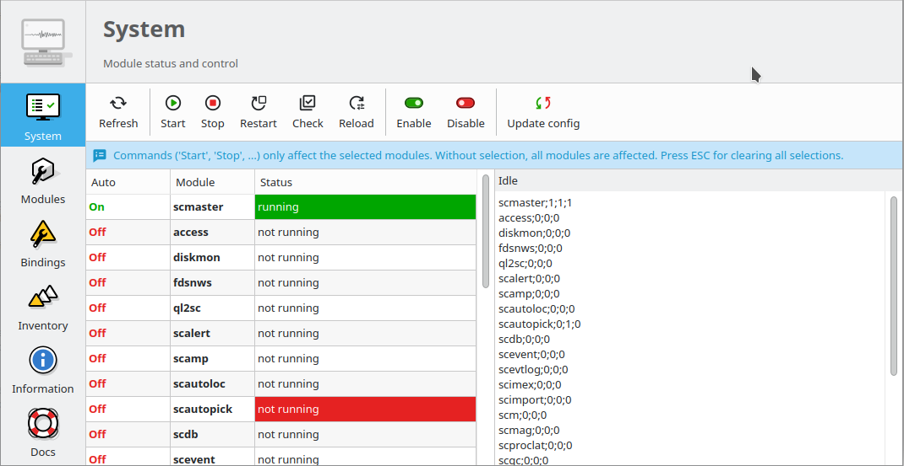

   System panel

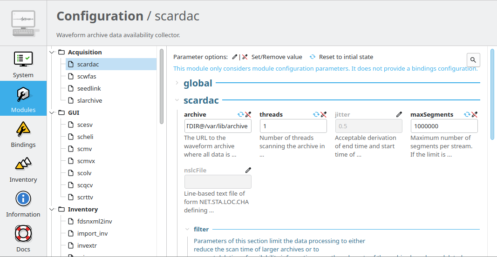

   Modules panel

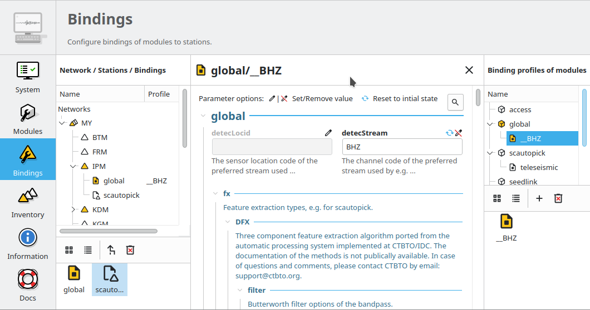

   Bindings panel

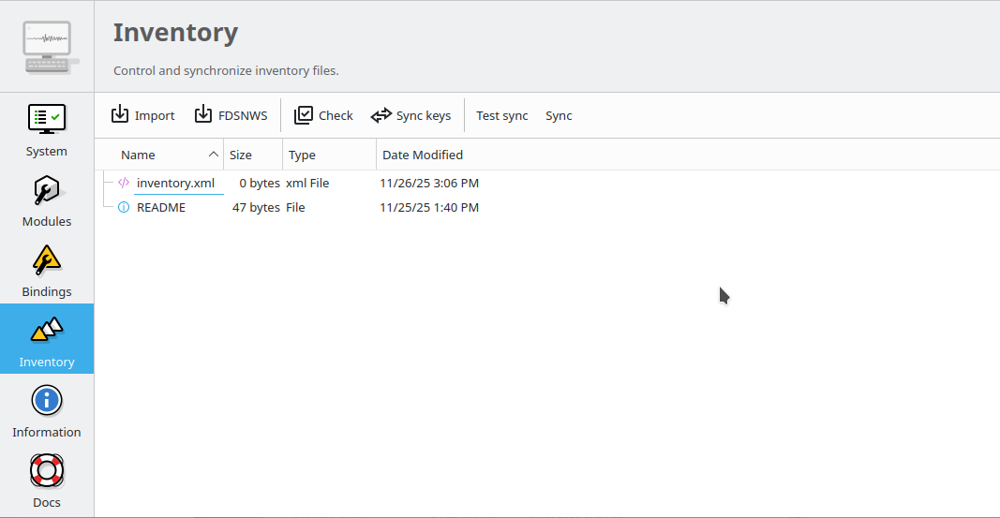

   Inventory panel

.. raw:: html

   

   scconfig is a graphical user interface which allows to

* :ref:`Control modules <scconfig-system>` (start/stop/check/enable/disable) and
  access logging file,
* Create and adjust the :ref:`configuration<concepts_configuration>` of
  :ref:`modules <scconfig-modules>` and :ref:`bindings <scconfig-bindings>` for
  all configurable |scname| modules including all
  :term:`trunk<trunk>` and :term:`standalone<standalone module>` modules,
* :ref:`Import, check, synchronize and remove <scconfig-inventory>`
  :ref:`station meta data/inventory <concepts_inventory>`,
* Retrieve :ref:`information <scconfig-information>` about the installed |scname|
  system,
* Access the :ref:`documentation and the changelog <scconfig-documentation>`.

The modules are usually programs part of the |scname| system and have two
distinct types of configuration (see section :ref:`concepts_configuration` for
a more complete documentation):

* :ref:`Modules configuration <scconfig-modules>` stored in configuration
  files like :file:`scautopick.cfg`.
* :ref:`Bindings <scconfig-bindings>`, that are sets of parameters to configure
  how the module will treat a certain station. I.e. station-specific
  configurations per module. Bindings can be configured using profiles, or
  directly per station. A profile is a named set of parameters for a certain
  module that can be conveniently attributed to more than one station. Using
  profiles makes it easier to maintain large number of station configuration.
  When two stations are configured by the same profile, both will have the same
  parameter set for a certain module.

scconfig does not know anything about the |scname| database. It actually only
reads and writes the content of files from :file:`etc/` and
:file:`~/.seiscomp` folder. scconfig allows you to manage this information in an
organized and friendly manner and supports you in generating clean
configurations and operating modules. Also, it relies on other applications
like the proper :ref:`seiscomp` tool to complete the system configuration.

.. _scconfig-first-start:

First start
-----------

If started for the first time, scconfig will ask the user to setup essential
configurations.

.. figure:: media/scconfig-first-start.*
   :align: center
   :width: 10cm

The setup steps will allow you to (read also :ref:`getting-started`):

* Configure general IDs such as the agency ID which will be written to the
  global module configuration in :file:`@SYSTEMCONFIGDIR@/global.cfg`,
* Setup a |scname| database,
* Configure the :ref:`scmaster` module with the |scname| database
  (:file:`@SYSTEMCONFIGDIR@/scmaster.cfg`).

If done already with the :ref:`command line interface <getting-started-setup>`,
this step can be skipped. Whether the setup was done before is indicated by
the presence of the file :file:`var/run/seiscomp.init`.

If you wish to run the setup, continue by pressing **Yes**. The wizard will be
started and will configure exactly the same parameters as described in
:ref:`getting-started`.

.. figure:: media/scconfig-wizard-start.*
   :align: center
   :width: 10cm

.. figure:: media/scconfig-wizard-finish.*
   :align: center
   :width: 10cm

Pressing **Finish** will run the setup and show the progress. Any issue
requiring actions or causing the setup to fail will be reported. A success
message is printed upon complete setup.

.. figure:: media/scconfig-wizard-done.*
   :align: center
   :width: 10cm

Pressing **Close** will launch the main configuration window.

.. _scconfig-mainwindow:

Main Window
-----------

The layout of the main window is always the same regardless of what panel
is selected.

.. _fig-scconfig-mainwindow:

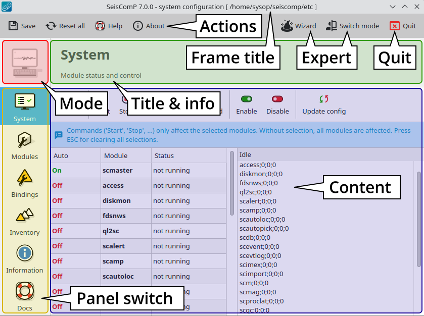

   Main window of scconfig: frame title, action buttons, mode indicator (red),
   panel selection (yellow), panel title and information (green), panel content
   (blue).

The window is divided into main areas:

* Frame title,
* Buttons for common and expert actions,
* Red: Mode indicator, :ref:`system and user mode<scconfig-mode>` are
  indicate by a screen and an avatar, respectively,
* Yellow: Panel switch,
* Green: Title and description of current panel,
* Blue: The content and interactive screen of the current panel.

Frame title
^^^^^^^^^^^

The frame title shows general information on the current SeisComP version and
the configuration mode (system or user) along with the directory to store module
configurations. The hostname is additionally displayed when starting scconfig
on a remote host.

Actions
^^^^^^^

* Saving (:kbd:`Ctrl+S`): Store changed parameters and value in configuration
  in files.
* Reset all (:kbd:`Ctrl+R`): Load the configuration currently available in
  files resetting all unsaved changes.
* Help (:kbd:`F1`): Open the HTML documentation of scconfig.
* Wizard (:kbd:`Ctrl+N`): Start the :ref:`inital setup <scconfig-first-start>`.
* Switch mode: Change the mode of configuration, see section
  :ref:`scconfig-mode`. The current mode is indicated by the mode area:

  * screen: System mode
  * avatar: User mode

* Quit: Finish scconfig.

.. _scconfig-system:

System panel
------------

The system panel is a graphical frontend for the :ref:`seiscomp` script. Read
also section :ref:`system-management`  for more details.

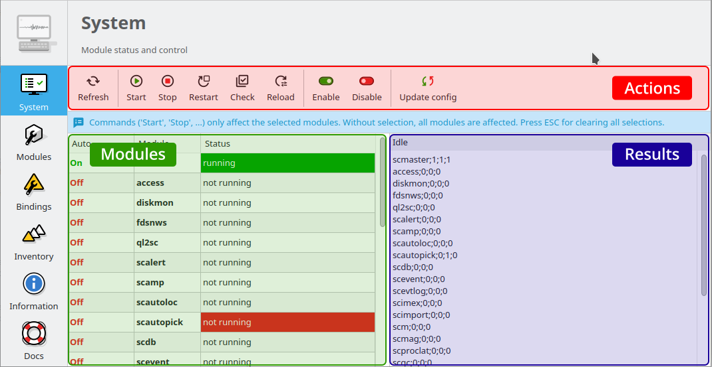

It is divided into 3 parts: the toolbar on the top (red), the module list (green)
and the log window (blue).
The log window shows the output of all external programs called such as :program:`seiscomp`.
The standard output is colored black and standard error is colored brown.

.. note::
   Due to the buffering of the GUI it can happen that standard output and
   standard error logs are not in perfect order.

Actions
^^^^^^^

The toolbar gives access to the available operations. All operations
will affect the currently selected modules (rows). If no row is selected, all
modules are affected and the corresponding call to :program:`seiscomp <arg>` is
done without any module. Also read the documentation of :ref:`seiscomp` for more
details.

*Reload*
 Updates the current module state. The action is useful in case the module state
 was changed by external actions. Calls :program:`seiscomp --csv status`.

*Start*
 Starts all selected modules. If no module is selected, all enabled modules are
 started. Calls :program:`seiscomp start`.

*Stop*
 Stops all selected modules. If no module is selected, all started modules are
 stopped. Calls :program:`seiscomp stop`.

*Restart*
 Restarts (stops and starts) all selected modules. If no module is selected,
 all started modules are stopped and all enabled modules are started. Calls
 :program:`seiscomp restart`.

*Check*
 Tests all selected modules if they have stopped unexpectedly. Such modules are
 started. If no module is selected, all started modules are checked. Calls
 :program:`seiscomp check`.

*Reload*
 Reloads the configuration of all selected modules. If no module is selected,
 the configuration of all modules is reloaded. The action is only applicable
 to selected modules. Calls :program:`seiscomp reload`.

*Enable*
 Enables all selected modules for autostart when running
 :program:`seiscomp start` or :program:`seiscomp restart`.
 At least one module must be selected. Calls :program:`seiscomp enable`.

*Disable*
 Disables all selected modules for autostart.
 At least one module must be selected. Calls :program:`seiscomp disable`.

*Update config*
 Starts :ref:`scmaster`, synchronizes the inventory and sends configuration of
 bindings and :term:`standalone modules<standalone module>` to the messaging.
 Perform this important action after the module configuration or bindings have
 changed and before restarting the affected modules. Calls
 :program:`seiscomp update-config`.

.. important::

   For applying an action to all modules deselect any modules selection pressing
   :kbd:`ESC` and press the corresponding action button. When one or multiple
   modules are selected, the action is only applied to those.

Diagnosing
^^^^^^^^^^

For diagnosing module performances you may read module log files. The latest
log files can be directly accessed from the system panel:

#. Right click on the module name for which to read the log entries.
#. Select the type of log to read. Only available logs can be selected. Normally
   you would want to read the module log which is by default written per
   module to :file:`$HOME/.seiscomp/log/[module].log`.

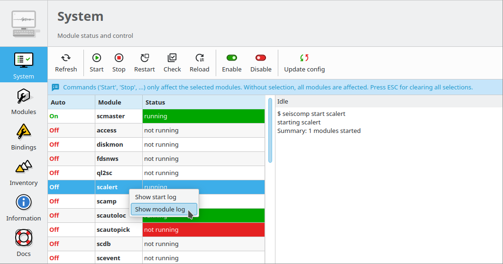

.. hint::

   The logging level is configurable per module by :confval:`logging.level`.

.. _scconfig-modules:

Modules panel
-------------

The Modules panel allows the configuration of all registered modules.

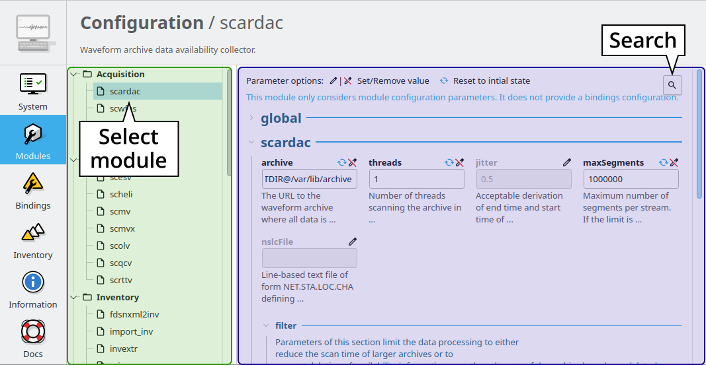

The left/green part shows the list of available modules grouped by defined
categories and the right/blue part shows the current active module configuration.
The active configuration corresponds to the selected module in the list.

Adjust module configuration
^^^^^^^^^^^^^^^^^^^^^^^^^^^

Read section :ref:`global_modules_config` for details on module configuration.
See also section :ref:`scconfig-editing` for further information about the
content panel.

Adjust module configuration
^^^^^^^^^^^^^^^^^^^^^^^^^^^

Read section :ref:`global_modules_config` for details on module configuration.
See also section :ref:`scconfig-editing` for further information about the
content panel.

.. _scconfig-modes:

System/user mode
^^^^^^^^^^^^^^^^

The module configuration content that is displayed depends on the current
configuration mode. Two modes exist:

* System mode: Module configurations are stored in files per modules like
  :file:`etc/<module>.cfg`. This is the default and usually, the preferred
  configuration mode.
* User mode the files are stored as :file:`$HOME/.seiscomp/<module>.cfg`.
  Parameter values set in user mode override system-mode configurations.

You may change the mode by pressing the action button **Switch mode** (section
:ref:`scconfig-mainwindow`). The mode is indicated by the mode indicator
widget (section :ref:`scconfig-mainwindow`).

.. note::

   Bindings configurations (section :ref:`scconfig-bindings`) are not affected
   by mode changes.

It may happen that a configuration parameter is editable but editing will not
have any affect on the module configuration. This is caused by the different
configuration stages. If the system configuration is active but a parameter has
been set in the user configuration it cannot be overridden in the system
configuration. The user configuration is always of higher priority. scconfig
will detect such problems and will color the input widget red in such situations.

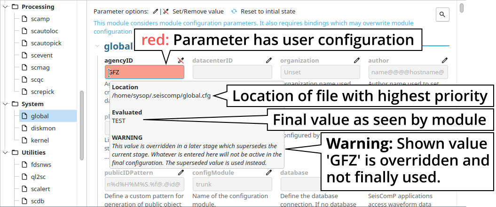

   Warning in case a value is overridden by user configuration.

The value in the edit widget will show the currently configured value in the
active configuration file but the tooltip will show the evaluated value, the
location of the definition and a warning.

.. _scconfig-bindings:

Bindings panel
--------------

The binding panel configures a station for a module providing station-specific
configuration such as data acquisition or processing. Read section
:ref:`global_bindings_config` for details on bindings configuration.

You may configure station
bindings or binding profiles. The profiles are typically applied to a set of
stations. Any change in the profile parameters is applied to all stations bound
to it.

.. hint::

   * Working with :ref:`bindings profiles <scconfig-bindings-profile>` allows to
     maintain a single set of binding parameters for one or multiple stations.
     :ref:`Station bindings <scconfig-bindings-station>` are useful if a set of
     binding parameters are applied only to a single station. Otherwise configure
     :ref:`binding profiles <scconfig-bindings-profile>`.
     :ref:`Profiles <scconfig-bindings-profile>` are therefore usually preferred
     over :ref:`station bindings <scconfig-bindings-station>`.
   * Creating or modifying bindings or bindings parameters requires to run
     :program:`seiscomp update-config` and to restart the affected modules in
     order for the changes to take an effect.

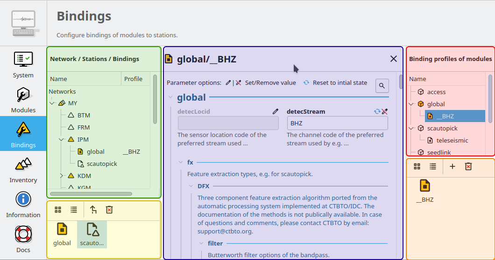

The binding panel is separated into 3 main areas:

* Station tree (green + yellow). In the upper (green) part you may select an item of
  which the content is displayed in the lower (yellow) section.
* Binding parameter content (blue) where you may adjust parameter values.
* Module tree (red + orange). In the upper (red) part you may select a module
  of which the profiles are displayed in the lower (orange) section.

The station tree (green) shows a tree of all available networks and their
stations. Each stations contains nodes of its configured bindings. The lower
view (yellow) represents the content of the currently selected item in the
station tree.

The binding parameter content (blue) shows the content of a binding and is
similar to the module configuration content. A :ref:`search function <scconfig-modules-search>`
as for module configuration parameters exists. See section :ref:`scconfig-editing`
for further information about this panel.

The module tree contains all modules which can be used along with bindings.
The upper (red) window contains the modules and all available binding profiles
for each module and the lower (orange) part shows all binding profiles of the
currently selected module. This view is used to add new profiles and delete
existing profiles.

.. _scconfig-bindings-profile:

Profiles
^^^^^^^^

Create a profile
~~~~~~~~~~~~~~~~

For creating a binding profile select a module in the module tree (red)
and right-click on the module or select the "add" button in the lower (orange)
panel. Provide a descriptive name. Clicking on the name of the profile opens the
profile allowing to adjust the parameters.

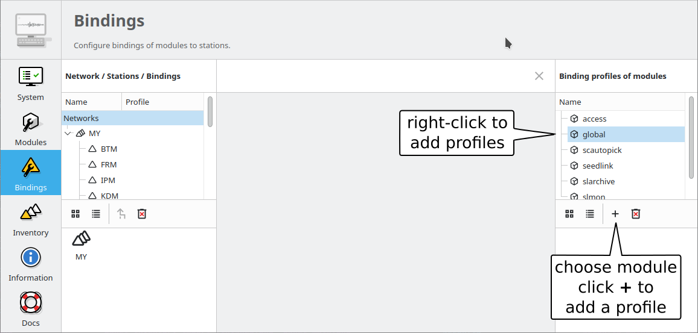

Create bindings
~~~~~~~~~~~~~~~

Assigning a binding profile to one or more stations creates one or more bindings.
To assign a binding profile to

* A single station,
* A single network including all stations or
* All networks.

#. Select a profile by mouse click
#. Drag the selected profile from the right part (red or orange)
   to the target in the left part (green or yellow).

Multi-selection of networks and stations is supported by holding the keys
:kbd:`Shift` or :kbd:`Ctrl` while clicking on a network or a station.

It is not possible to drag and drop multiple profiles with one action.

.. _scconfig-bindings-station:

Station bindings
^^^^^^^^^^^^^^^^

To create an exclusive station binding for a module, it must be opened in the
binding view (yellow) by either selecting a station in the station tree
(green) or opening/clicking that station in the binding view (yellow). The
binding view will then contain all currently configured bindings.

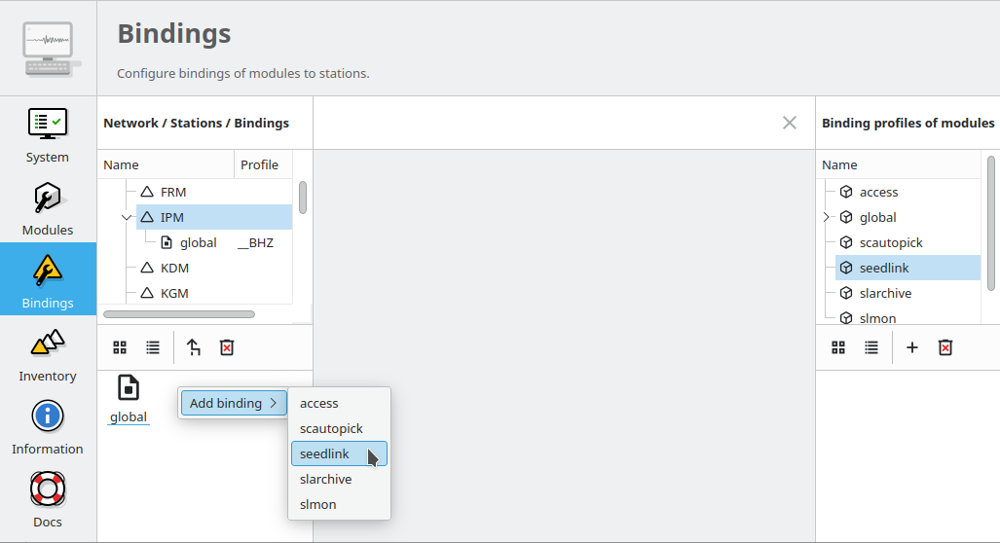

Clicking with the right mouse button into the free area will open a menu which
allows to add a binding for a module which has not yet been added. Adding
a binding will activate it and bring its content into the content panel.

To convert an existing profile into a station binding, right click on the
binding icon and select :menuselection:`Change profile --> None`. The existing
profile will be converted into a station binding and activated for editing.

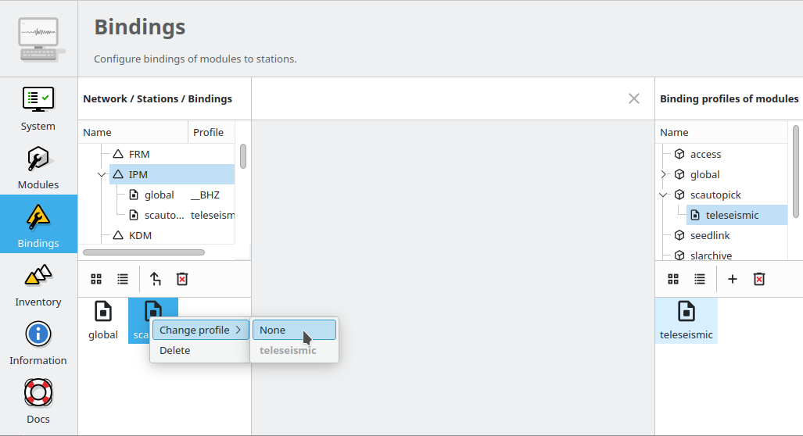

   Convert a binding profile to a station binding.

Reversely, you may select a profile for binding it to a station.

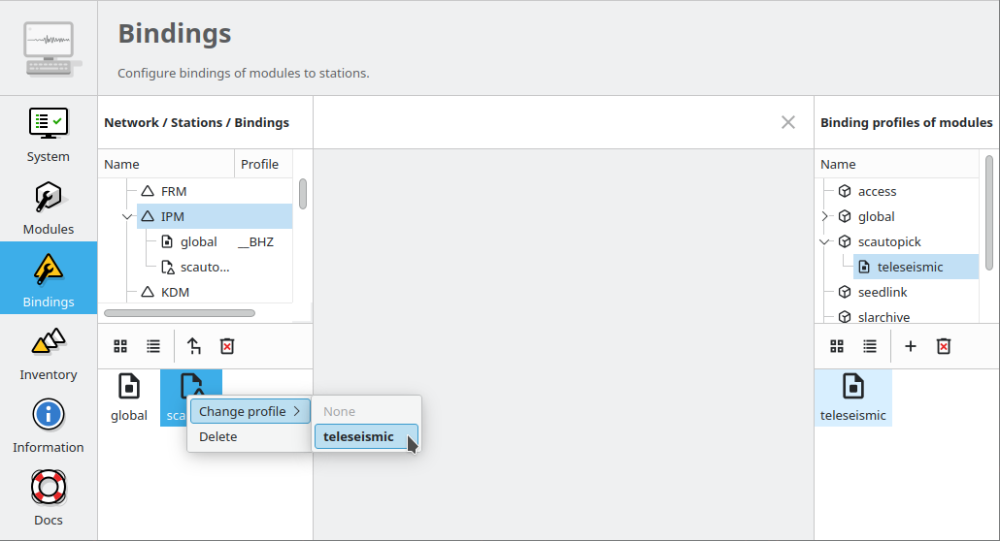

   Convert a station binding to a binding profile.

Apply bindings
^^^^^^^^^^^^^^

The bindings parameters must be additionally written to the database or as for a
:term:`standalone module` converted to the specific module configuration by
updating the configuration. You may update configuration for all modules or just
the specific one. To this end, change to the
:ref:`System panel <scconfig-system>` select the specific module or none and
press the button "*Update configuration*".

Alternatively, execute the :ref:`seiscomp` script on the command line for all or
the specific module:

.. code-block:: sh

   seiscomp update-config
   seiscomp update-config module

.. _scconfig-editing:

Editing parameters
------------------

The content panel of a configuration is organized as a tree. Each module/binding
name is a top-level item and all namespaces are titles of sections which can be
expanded or collapsed.
Namespaces are separated by dot in the configuration file, e.g.
:file:`scautopick.cfg` which also reads :file:`global.cfg` would end up in a tree
like this:

.. code-block:: sh

   + global
   |  |
   |  +-- connection
   |  |    |
   |  |    +-- server (global.cfg: connection.server)
   |  |    |
   |  |    +-- username (global.cfg: connection.username)
   |  |
   |  +-- database (global.cfg: database)
   |
   + scautopick
      |
      +-- connection
      |    |
      |    +-- server (scautopick.cfg: connection.server)
      |    |
      |    +-- username (scautopick.cfg: connection.username)
      |
      +-- database (scautopick.cfg: database)

Figure :ref:`fig-scconfig-modules-global` describes each item in the content
panel.

When configuring module configuration parameters (in contrast to bindings), the
parameters can can be set in system and user mode. While system  mode is the
default and usually used, parameters set in user mode override system mode. Read
section :ref:`scconfig-mode` for the details.

.. _scconfig-modules-search:

Searching
^^^^^^^^^

Searching parameters by name, value or description (tooltip) in the modules
configuration panel is easy by the advanced search function:

#. Click on the lens in the parameter section or press :kbd:`Ctrl+F` for
   activating the search mask.
#. Enter the string you wish to search for.
#. Hit enter to search. The first match is highlighted.
#. Once a string is found, you may continue to search up and down the list of
   matches by clicking on the arrow up and down buttons, respectively.

.. figure:: media/panel-modules-search.png
   :align: center
   :width: 15cm

   Advanced search function. The section containing a match is highlighted.

Adjust values
^^^^^^^^^^^^^

In order to adjust a parameter:

#. Click on the edit button above the parameter field (pen)
#. Enter or select the value
#. Save the configuration (:kbd:`Ctrl+S`)
#. To finally apply the change you need to restart the module. In case bindings
   were changes, updating the configuration before restarting is required.

Once a parameter has been changed the value may removed by pressing the remove
button (pen with red line), effectively returning to the default. Before saving,
you may reset the value to the previously saved state by pressing the reset
button (blue circular arrows).

.. _fig-scconfig-modules-global:

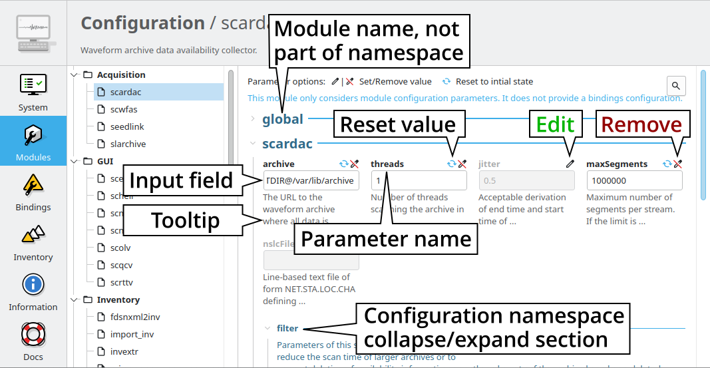

   Content panel layout

Evaluation
^^^^^^^^^^

The content of the input field (except for boolean types which are mapped
to a simple checkbox) is the parameter value.
While typing an evaluation box pops up which contains the parsed and interpreted
content as read by an application. It shows the number of parsed list items, possible
errors or warnings and the content of each list item. The full list of value
types and options to be tested is documented in the
:ref:`table of description parameters<xml-configuration-parameter>`.

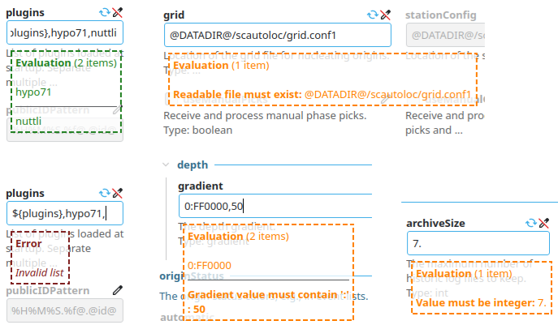

   Examples of value syntax evaluation.

.. _scconfig-inventory:

Inventory panel
---------------

The inventory panel allows to import, check and synchronize inventory files as
well as to inspect the content or to rename or remove the files. The panel shows
a list of inventory XML files located in folder :file:`etc/inventory`. Only
:term:`SCML` files can be used as source for inventory data but various importers
exist to integrate inventory data from other formats. After the first start
the list is empty and contains only a README file.

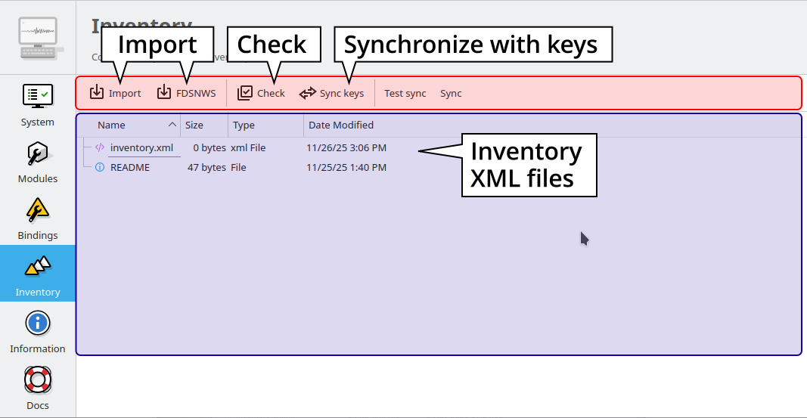

Importing station meta data is outlined in the
:ref:`tutorial on adding a station <tutorials_addstation>`.

Servers running FDSNWS :cite:p:`fdsn` as operated at :cite:t:`geofon` or other
data centers :cite:p:`fdsn-datacenters` are modern sources of inventory
information. In scconfig you may fetch inventory directly from FDSN servers.
Alternatively, you may navigate to such servers, download the inventory
files and integrate the into |scname|. Both ways are supported by scconfig.

Depending on configuration and architecture, FDSN servers provide
inventory in :term:`SCML` and/or FDSN station XML :cite:p:`fdsn-specs` but other
sources may provide other formats. |scname| supports reading inventory in a
variety of different formats such as:

* scml: :term:`SCML`
* fdsnxml: FDSN station XML :cite:p:`fdsn-specs`
* dlsv: dataless SEED volume
* arclink: Arclink XML

Ultimately, the inventory must be converted into :term:`SCML` which is
supported by scconfig.

.. warning::

   Ensure to provide full inventory including responses for the time period of
   interest for data processing. Waveform data without corresponding inventory
   cannot be processed.

Toolbar actions
^^^^^^^^^^^^^^^

The toolbar supports various actions:

*Import*
 You may upload and integrate the inventory from file in any supported original
 format. Read section :ref:`scconfig-inventory-file`.

*FDSNWS*
 You may connect to any FDSN server providing station information and integrate
 the requested meta data into your |scname| configuration.  Read section
 :ref:`scconfig-inventory-fdsnws`.

*Check*
 The inventory is checked for issues including inconsistencies which are reported.
 The tests are based on :ref:`scinv` and listed in the documentation of this
 module. Adjust sensitivity by configuring :ref:`scinv`.

 The equivalent command-line action is

 .. code-block:: sh

    scinv check

*Sync keys*
 This action is part of sync but can be called also standalone. It merges all
 inventory XML files and creates key files in :file:`etc/key/station_*` if a
 key file does not yet exist. Existing key files are not touched unless the
 station is not part of the inventory anymore.

 The equivalent command-line action is

 .. code-block:: sh

    scinv keys

 As a result, all stations in inventory will have a corresponding key file and
 each key file will have a corresponding station in inventory.

*Test sync*
 The inventory XML files are not used directly with |scname|. They need to
 be synchronized with the database first (see :ref:`global-stations`).
 Synchronization needs to merge all existing XML files and create differences
 against the existing database tables. While merging conflicts can occur such
 as duplicate stations with different content (e.g. different description).
 This action is a dry-run of the actual synchronization. It performs merging
 and creates differences but does not send any update. This actions is useful
 to test all your existing inventory files before actually modifying the
 database.

 The equivalent command-line action is

 .. code-block:: sh

    scinv sync --test

 .. figure:: media/panel-inventory-sync-passed.png
    :align: center
    :width: 15cm

*Sync*
 Almost identical to *Test sync* but it does send updates to the database and
 additionally synchronizes key files and resource files.

 The equivalent command-line action is

 .. code-block:: sh

    scinv sync

*Sync* and *Sync keys* will cause a reload of the configuration to refresh the
current binding tree (see :ref:`scconfig-bindings`).

.. _scconfig-inventory-fdsnws:

Import from FDSNWS
^^^^^^^^^^^^^^^^^^

Inventory files can be directly imported from FDSN server by pressing the
**FDSNWS** button in the toolbar on the top. Pressing the button will open a
popup allowing to enter the FDSN server address and the inventory constraints.
Include responses and set the time period by Start and End. Unset values do not
impose any limit. When done

#. Press **Fetch**
#. Inspect the stream table
#. Press **OK** to download and integrate the inventory.

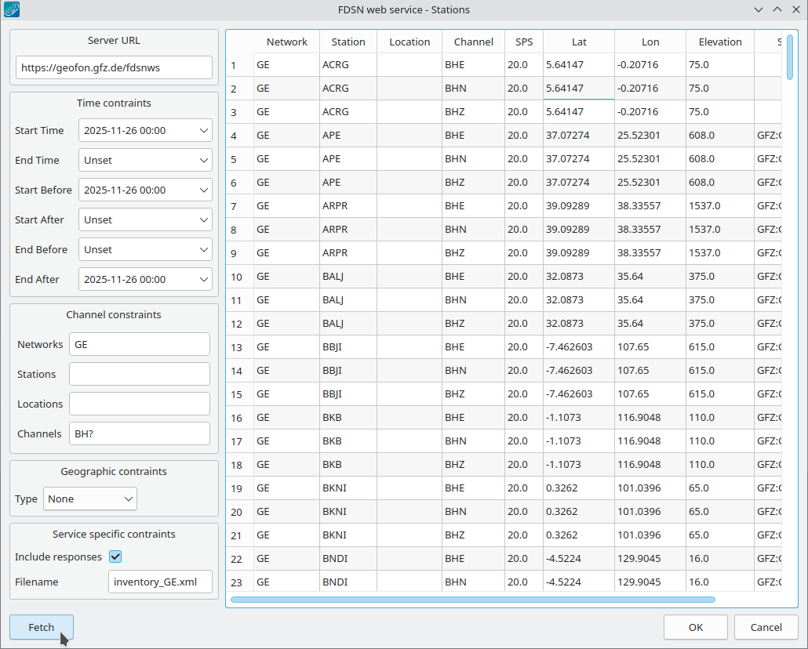

   Import inventory: After fetching from FDSN server and before integration the
   stream list can be inspected.

.. hint::

   File names must end on *.xml*. It is recommended to use consistent file
   names, e.g., :file:`inventory_[networkCode].xml`.

.. _scconfig-inventory-file:

Import from file
^^^^^^^^^^^^^^^^

External inventory files can be imported by pressing the **Import**
button in the toolbar on the top. Pressing the button will open a popup allowing
to select for input format.

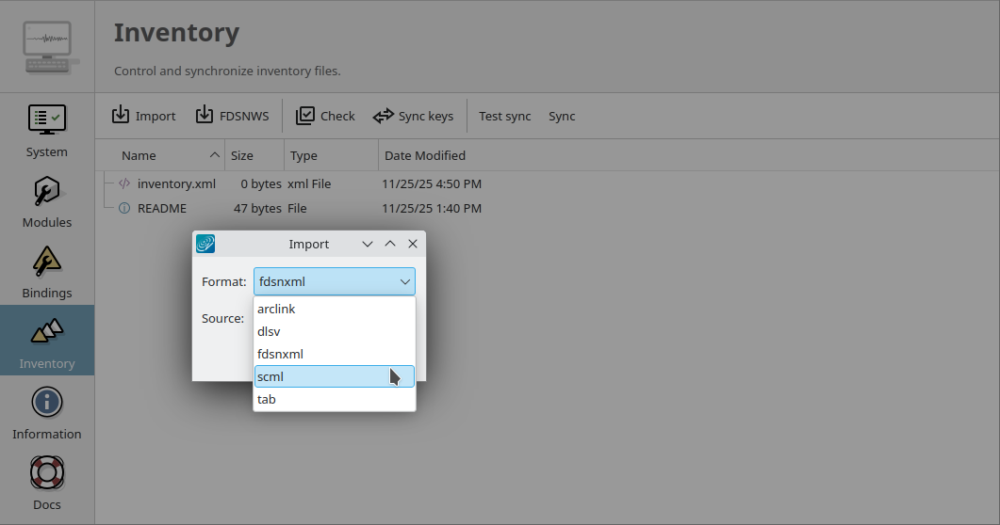

   Import inventory: File format selection

If *fdsnws* is selected, the source location should then point to the FDSN
stations XML file downloaded before.

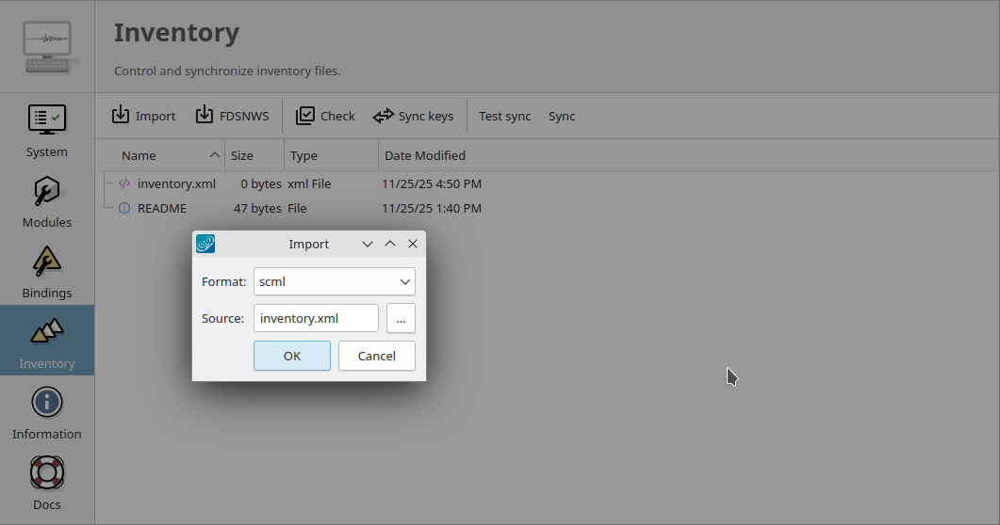

   Import inventory: File selection

If successfully imported a window will popup with the execution result and
the import output.

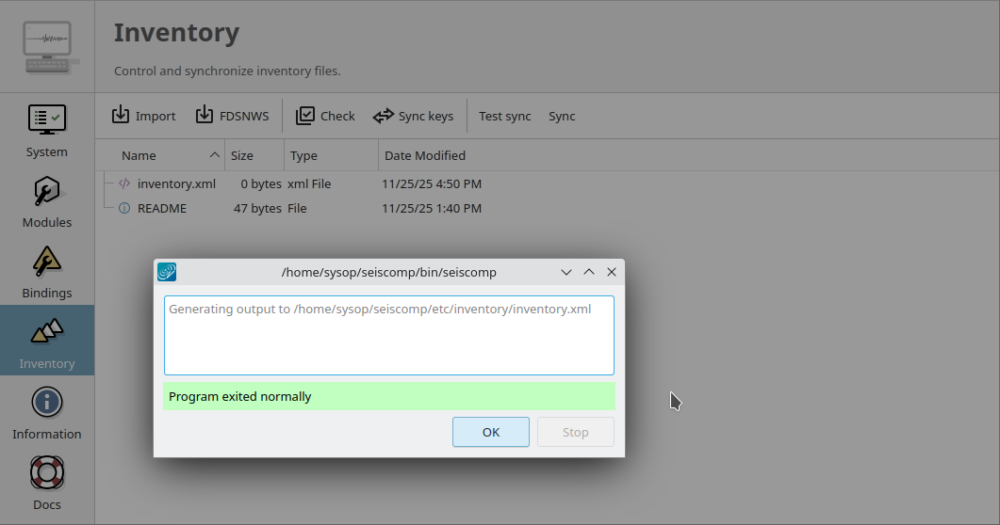

   Import inventory: Success

After closing the popup, the imported inventory file will show up in the list of
files. Right-clicking a file allows:

* Checking (quality control),
* Renaming,
* Deleting,
* Inspecting the content of

the file.

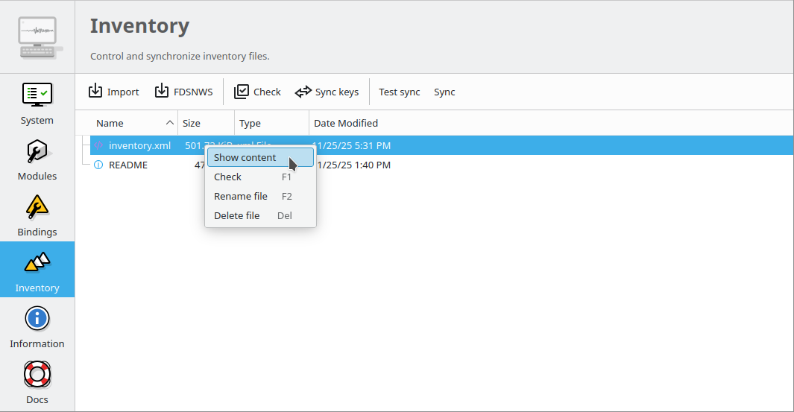

.. hint::

   File names must end on *.xml*. It is recommended to use consistent file
   names, e.g., :file:`inventory_[networkCode].xml`.

.. _scconfig-information:

Information panel
-----------------

This panel shows information about the |scname| environment including system
variables and the |scname| variable related to the currently executed instance
of scconfig.

.. _fig-scconfig-mainwindow:

.. figure:: media/panel-information.png
   :align: center
   :width: 15cm

   Information panel.

All |scname| variables can be used as placeholders in most of the configuration
parameters which define directories or files. The variables are encapsulated by
**@**. Example:

.. code-block:: sh

   autoloc.grid = @CONFIGDIR@/autoloc/local.grid

.. _scconfig-documentation:

Documentation and changelog
---------------------------

Access the documentation and the changelog of any installed package from the
Docs panel. Double-click on the red or blue button to open the documentation
or the changelog, respectively.

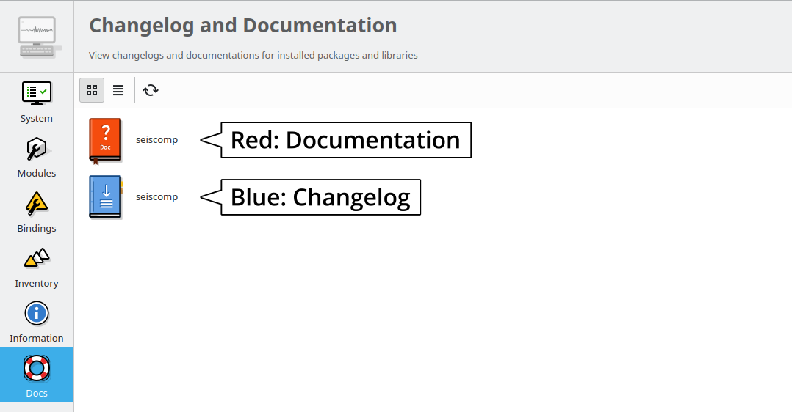

.. _scconfig_hotkeys:

Shortcuts / Hotkeys
-------------------

.. csv-table::
   :header: Hotkey, Description
   :widths: 20 80
   :align: left
   :delim: ;

   **General** ;
   1       ; Switch to System panel
   2       ; Switch to Modules panel
   3       ; Switch to Bindings panel
   4       ; Switch to Inventory panel
   5       ; Switch to Information panel
   6       ; Switch to Docs panel
   Ctrl + N; Start wizard for setting up initial global parameters, database and messaging
   Ctrl + Q; Quit scconfig. Changed parameters may be saved file before eventually quitting.
   Ctrl + R; Reset all changed parameters to values saved on disk
   Ctrl + S; Save parameter values
   F1      ; Open locally installed HTML documentation of scconfig
   **Bindings panel**;
   Ctrl + F; Search parameters and descriptions
   **Module panel**;
   Ctrl + F; Search parameters and descriptions
   **Inventory panel**;
   Del     ; Delete selected file
   F2      ; Rename selected file
   F3      ; Check the selected file executing *scinv check*
