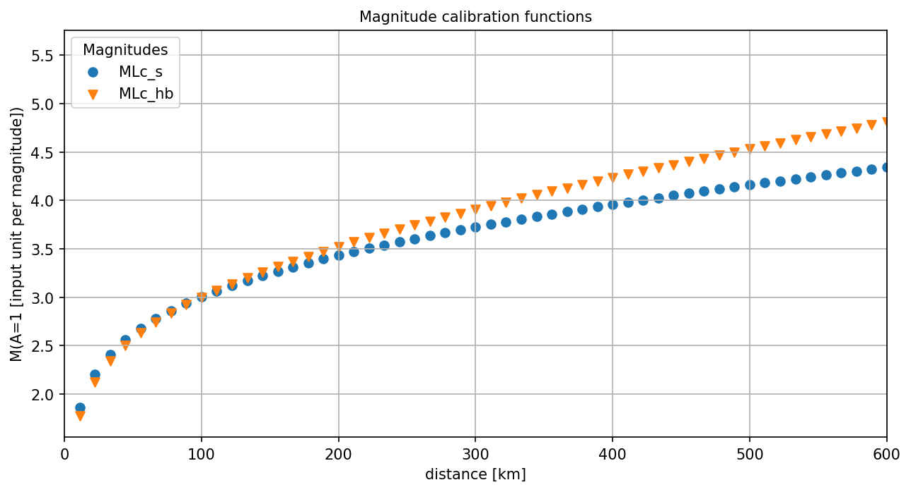

MLc is the custom magnitude for local events provided by the mlc plugin.
The implementation is based on specifications by Hessian Agency for Nature
Conservation, Environment and Geology, Hessian Earthquake Service.

The MLc magnitude is very similar to the original :ref:`ML<global_ml>`,
except that by default

* Amplitude pre-filtering is applied.
* A parametric :ref:`magnitude calibration <mlc_station_magnitude>` function
  applies.
* Hypocentral distance is used.

Regionalization of magnitude computation is provided through global module
configuration.
Configuration of global bindings provides additional flexibility:

* Amplitudes can be pre-filtered before applying Wood-Anderson simulation
  (:confval:`amplitudes.MLc.preFilter`),
* Wood-Anderson simulation is optional:
  :confval:`amplitudes.MLc.applyWoodAnderson`,
* Measured amplitudes can be scaled accounting for expected unit
  (:confval:`amplitudes.MLc.amplitudeScale`),
* A parametric or A0-based non-parametric
  :ref:`magnitude calibration <mlc_station_magnitude>`
  function can be applied as controlled by
  :confval:`magnitudes.MLc.calibrationType`.
* Consider either hypocentral or epicentral distance for computing magnitudes
  (:confval:`magnitudes.MLc.distMode`).

General (default) conditions apply, all values are configurable:

* Amplitude pre-filtering: :ref:`BW(3,0.5,12) <filter-bw>`.
* Amplitude unit in SeisComP: **millimeter** (mm) or as considered by the
  configured calibration parameters.
* Optional amplitude scaling: 1.
* Wood-Anderson simulation: yes.
* Time window: 150 s by :ref:`scautopick` or distance dependent
  with :math:`endTime = distance [km]/ 3 + 30`, e.g. by :ref:`scmag` or
  :ref:`scolv`.
* Distance type: hypocentral.
* Distance range: 0 - 8 deg, measurements beyond 8 deg will be
  strictly ignored.
* Depth range: <= 80 km.
* Magnitude calibration: parametric.

Amplitudes
----------

MLc amplitudes can be measured automatically by :ref:`scautopick` or :ref:`scamp`
or interactively by :ref:`scolv` very similarly to the original :ref:`ML<global_ml>`,
except that they can be pre-filtered and applying Wood-Anderson simulation is
optional: :confval:`amplitudes.MLc.preFilter`,
:confval:`amplitudes.MLc.applyWoodAnderson`.
By default amplitudes are measured on both horizontal components where the
absolute maxima are taken. They are combined to a final measured amplitude by
taking the mean. The methods for measuring and combining the amplitudes are
configurable:
:confval:`amplitudes.MLc.measureType`, :confval:`amplitudes.MLc.combiner`.

The Wood-Anderson simulation will convert input velocity data to ground
displacement in mm. The input data may be of a different unit after applying
:confval:`amplitudes.MLc.preFilter`, e.g. when integration is applied, and / or
when Wood-Anderson simulation is disabled. Configure
:confval:`amplitudes.MLc.amplitudeScale` for converting the unit of the
processed data to the unit expected by the
:ref:`station magnitude calibration <mlc_station_magnitude>` for the measured
amplitude.

.. note::

   For comparing MLc amplitudes with :ref:`ML amplitudes <global_ml>` set the
   global bindings parameters ::

      amplitudes.MLc.preFilter = ""
      amplitudes.MLc.combiner = average

.. _mlc_station_magnitude:

Station Magnitudes
------------------

Station magnitudes are computed from measured amplitudes automatically by
:ref:`scmag`
or interactively by :ref:`scolv`. By global bindings configuration MLc considers

* Hypocentral (default) or epicentral distance: :confval:`magnitudes.MLc.distMode`.
* Distance range: :confval:`magnitudes.MLc.minDist`, :confval:`magnitudes.MLc.maxDist`.
* Events with depth up to :confval:`magnitudes.MLc.maxDepth`.
* Parametric or non-parametric calibration functions

  * parametric when :confval:`magnitudes.MLc.calibrationType` = "parametric"`:

    .. math::

       MLc = \log_{10}(A) + c_3 * \log_{10}(r/c_5) + c_2 * (r + c_4) + c_1 + c_0(station)

    where

    * *A*: displacement amplitude measured in unit of mm or as per configuration
    * *r*: hypocentral (default) or epicentral distance
    * *c1*, *c2*, *c3*, *c4*, *c5*: general calibration parameters
    * *c0*: station-specific correction
    * *r*: Hypocentral (default) or epicentral distance as configured by
      :confval:`magnitudes.MLc.distMode`.

  * A0-based non-parametric when :confval:`magnitudes.MLc.calibrationType` = "A0"`:

    .. math::

       MLc = \log_{10}(A) - \log_{10}(A_0)

    where

    * :math:`log_{10}(A_0)`: distance-dependent correction value. Read
      :ref:`global_mlv` for the details.

.. note::

   The magnitude calibration function can regionalized by adjusting global module
   configuration parameters in MLc region profiles of
   :confval:`magnitudes.MLc.region.*` and in a *MLc* Magnitude type profile e.g.
   in :file:`global.cfg`.

Network Magnitude
-----------------

The network magnitude is computed from station magnitudes automatically by
:ref:`scmag` or interactively by :ref:`scolv`.
Originally the median was computed from all station MLc to form the
:term:`network magnitude` MLc. Here, the trimmed mean is applied. Outliers
beyond the outer 12.5% percentiles are removed before forming the mean. The
method can be adjusted in :ref:`scmag` by :confval:`magnitudes.average`.

Examples
--------

The flexibility of the amplitude and magnitude processing allows to apply MLc
in various use cases, e.g.

* **Default:** Pre-filtered and gain-corrected amplitudes, Wood-Anderson
  corrected and measured in mm for Southwestern Germany, :cite:t:`stange-2006`:

  .. math::

     MLc = \log_{10}(A) + 1.11 * \log_{10}(r) + 0.00095 * r + 0.69 + c_0

* Wood-Anderson-corrected displacement amplitudes measured in mm for
  Southern California, :cite:t:`hutton-1987`:

  .. math::

     MLc = \log_{10}(A) + 1.110 * \log_{10}(r / 100) + 0.00189 * (r - 100) + 3.0

* Pre-filtered velocity amplitudes in units of mym/s (requiring to set
  :confval:`amplitudes.MLc.amplitudeScale`), no Wood-Anderson correction,
  for West Bohemia, e.g. :cite:t:`hiemer-2012`:

  .. math::

     MLc = \log_{10}(A) - log_{10}(2\Pi) + 2.1 * \log_{10}(r) - 1.7 + c_0

   MLc magnitudes for measured amplitude of 1 mm with default magnitude
   calibration (*MLc_s*, :cite:t:`stange-2006`) and calibration values for Southern
   California (*MLc_hb*, :cite:t:`hutton-1987`).

Setup
=====

#. **Set the configuration and calibration parameters** in the global bindings
   similar
   to :ref:`global_ml`. Instead of configuring lots of global bindings profiles
   or station bindings one line per parameter can be added to the global module
   configuration (:file:`global.cfg`) which takes the form

   .. code-block:: params

      module.trunk.NET.STA.amplitude.MLc.preFilter = value
      module.trunk.NET.STA.magnitude.MLc.parametric.c0 = value

#. Add MLc to the list of default amplitudes and magnitudes if MLc is to be
   computed by automatic modules, e.g. of :ref:`scamp`, :ref:`scmag`.
#. Configure :ref:`scmag` (:confval:`magnitudes.average` in :file:`scmag.cfg`)
   for choosing the method to form the
   network magnitude from station magnitudes, e.g.

   .. code-block:: params

      magnitudes.average = MLc:median

#. Add MLc to the list of magnitudes preferred by :ref:`scevent`
   (:confval:`eventAssociation.magTypes` in :file:`scevent.cfg`) in order to let
   MLc become the preferred magnitude.
#. Set defaults/visibility of MLc in :term:`GUI` modules, e.g. :ref:`scolv`
   or :ref:`scesv`.

.. note ::

   All default values for bindings configuration parameters are from
   :cite:t:`stange-2006`.
