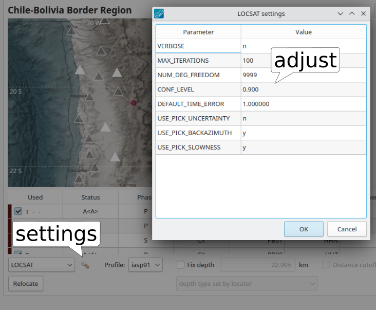

LOCSAT is a locator with a travel-time interface in |scname| for computing
source time and hypocenter coordinates from phase picks considering:

* Pick time and pick uncertainty,
* Backazimuth and backazimuth uncertainty,
* Slowness and slowness uncertainty,
* Phase-specfic travel-time tables.

The LOCSAT :ref:`locator interface <locsat_li>` implements a wrapper for the
LocSAT locator by :cite:t:`bratt-1991` (according to the README file shipped
with the LocSAT distribution) referred to as **LOCSAT** in |scname|. The LOCSAT
:ref:`travel-time interface <locsat_tti>` provides travel time for specfic
phases, epicentral distance, soure depth and station elevation.

.. _locsat_li:

Locator Interface
=================

LOCSAT provides the hypocenter parameters through the locator interface. Instead
of specifying an Earth model, LOCSAT queries travel times via the
:ref:`LOCSAT travel-time interface <locsat_tti>` which makes use of
:ref:`pre-defined travel-time tables <locsat_ttt>`. Note the
:ref:`limitations <locsat_tt>`.

Use "LOCSAT" as a value for the locator interface along with a profile when
configurable, e.g., by :ref:`scolv`, :ref:`scautoloc` or :ref:`screloc`.

.. _locsat_tti:

Travel-Time Interface
=====================

LOCSAT provides an interface for computing travel times based on station and
source coordinates with non-negative source depths. Note the
:ref:`limitations <locsat_tt>`.

The travel times are used for predicting phase arrival times in various
applications such as :ref:`scautoloc` or :ref:`scolv`. The times are visualized,
e.g., as blue marks in the :ref:`scolv picker window <scolv-sec-waveform-review>`.

Use "LOCSAT" as a value for the travel-time interface when configurable, e.g.,
by :ref:`global_fixedhypocenter` or :ref:`global_stdloc`.

.. _locsat_ttt:

Travel-Time Tables
==================

|scname| ships with two sets of predefined travel-time tables which are
made available as the profiles tab and iasp91.

The default profile is *iasp91*.

LOCSAT travel time tables are located as plain ascii files under
:file:`@DATADIR@/locsat/tables/`.
The tables provide the travel times for particular seismic phases at
given depth and epicentral distance in one file per Earth model and seismic
phase. E.g. P-wave arrival times in the iasp91 model are found in
:file:`@DATADIR@/locsat/tables/iasp91.P`. You may easily add your own tables
for any available Earth model and seismic phase by adopting existing ones in new
files which are added by :ref:`configuration <locsat_station_application>` to
your |scname| modules.

Limitations
-----------

#. The source depth is limited to non-negative values up to 800 km.
#. Only phases for which a travel-time table exists can be considered.
#. LOCSAT currently considers travel-time tables for phases which are hard-coded

   * seismic body waves: P, Pg, Pb, Pn, Rg, pP, sP, PKP, PP, PKPab, PKPbc, PKPdf,
     SKPdf, PcP,
     S, Sg, Sb, Sn, Lg, SKS, SS, ScS,

     where P and S are the direct P and S phases, respectively, at all distances
     no matter the take-off angle at the source.
   * seismic surface waves: LQ, LR.
   * infrasound: Is, It, Iw.

#. The maximum number of distance and depth intervals per table file is
   currently 210 and 50, respectively.

   .. warning::

      * Travel-time tables with larger numbers of distance or depth samples are
        reported along with command-line error output (stderr). The travel-time
        tables should therefore be tested, e.g., with :ref:`scolv` before
        unsupervised application.
      * Travel times at distance and depth samples exceeding the limits are
        ignored. This may lead to undesired behavior during location.
      * Phase picks observed outside the distance and depth ranges defined by
        travel-time tables may lead to undesired behavior during location.

#. The considered minimum depth is 0 km. Elevations and depths above datum are
   not natively considered. The effects of station elevation can be
   :ref:`corrected for empirically <locsat_station_elevation>`.

.. _locsat_station_elevation:

Station elevations
------------------

LOCSAT does not natively support corrections of travel-time tables for station
elevations. At least checking the code:

.. code-block:: c

   sta_cor[i]  = 0.0;    /* FIX !!!!!!*/

However, the |scname| wrapper adds this feature. It allows to define a
:file:`.stacor` file which defines emperic corrections of observed travel times.
The corrections are provided in seconds and **subtracted** (not added) from
the observation time to be compatible with the NonLinLoc :cite:p:`nonlinloc`
station correction definitions.

Each LOCSAT profile (travel time table) can have one associated station
correction file. E.g. for adding station corrections to the iasp91 tables, the
file :file:`$SEISCOMP_ROOT/share/locsat/tables/iasp91.stacor` needs to be created.

A station correction table takes the form:

.. code-block:: properties

   # LOCDELAY code phase numReadings delay
   LOCDELAY GE.MORC P 1 -0.1

with

- **code** (*string*) station code (after all alias evaluations)
- **phase** (*string*) phase type (any of the available travel time tables)
- **numReadings** (*integer*) number of residuals used to calculate mean residual/delay
  (not used by NLLoc, included for compatibility with the format of a summary,
  phase statistics file)
- **delay** (*float*) delay in seconds, subtracted from observed time

.. note::

   The fourth column (numReadings) is ignored and just provided for compatibility
   reasons with :ref:`NonLinLoc <global_nonlinloc>`.

.. _locsat_station_application:

Application and Setup
=====================

LOCSAT is the default and only locator for :ref:`scautoloc` with *iasp91* as the
default profile. However, LOCSAT can be used optionally in other modules such as
:ref:`scolv` or :ref:`screloc`.

.. _locsat_custom-ttt:

Custom travel-time tables
-------------------------

#. Generate your travel-time tables from a custom Earth model, depth and
   distance intervals. Use the same format as the defaults as the *iasp91*
   tables. Tools such as :cite:t:`taup` allow the generation.
#. Add your custom travel-time tables along with station corrections to
   :file:`@DATADIR@/locsat/tables/`
#. Add your available custom LOCSAT travel-time tables in global configuration,
   e.g., to the list of tables of travel-time interfaces

   .. code-block:: properties

      ttt.LOCSAT.tables = iasp91, tab, custom

   and to the list of locator profiles

   .. code-block:: properties

      LOCSAT.profiles = iasp91, tab, custom

   and optionally to locators which make use of LOCSAT tables, e.g.,
   :ref:`global_fixedhypocenter`.

Application with modules
------------------------

Additional parameters of LOCSAT may be configured in global module configuration
(:confval:`LOCSAT.*`).

* The profiles for locating may be extended or limited by
  :confval:`LOCSAT.profiles`.
* When using picks with time uncertainties, consider
  :confval:`LOCSAT.usePickUncertainties` and :confval:`LOCSAT.defaultTimeError`.
* Measurements of backazimuth and slowness may be deactivated by
  :confval:`LOCSAT.useBackazimuth` and :confval:`LOCSAT.useSlownewss`, respectively.
  Such measurements may be obtained from array processing or from feature
  extraction using :ref:`scautopick`.

You may also configure some |scname| modules with LOCSAT and a profile.

* :ref:`scautoloc`: Configure a profile for automatic locations,
* :ref:`screloc`: Configure *LOCSAT* along with a profile for automatically
  relocating.
* :ref:`scolv`: Configure *LOCSAT* along with a profile  as defaults for
  interactive locations.

When using LOCSAT in :ref:`scolv` you may interactively some settings. The
changes only apply during runtime.

   scolv Location tab with LOCSAT selected and the settings menu.
